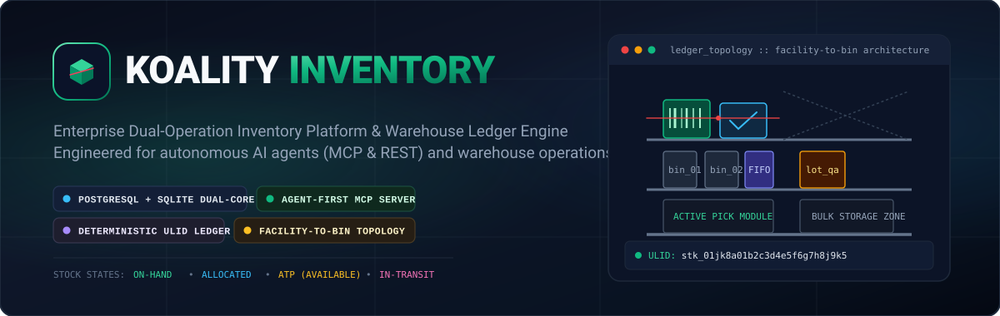
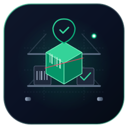
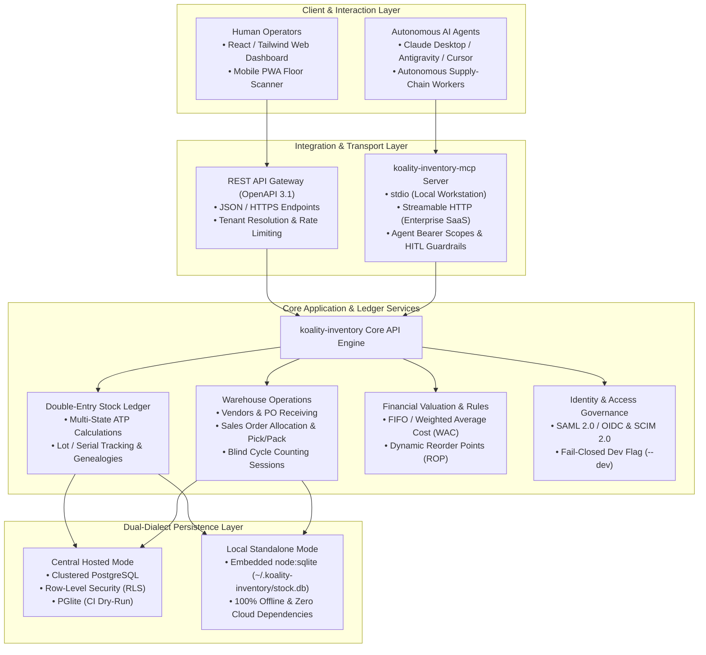

<div align="center">
  
</div>

<div align="center">
  
  <h1>Koality Inventory</h1>
  <p><strong>Enterprise Inventory Management &amp; Autonomous Agent Warehouse Ledger</strong></p>

[](https://github.com/Koality-Assured/koality-inventory/actions/workflows/ci.yml)
[](https://github.com/Koality-Assured/koality-inventory/blob/main/LICENSE)
[](https://nodejs.org/)
[](https://www.typescriptlang.org/)
[](#2-dual-path-operating-model)
</div>

---

## Elevator Pitch & Mission

**Koality Inventory** is an open-source, enterprise-grade inventory management system (IMS) and warehouse management platform engineered specifically for **dual-agent operation**: autonomous AI agents interacting via the [Model Context Protocol (MCP)](https://github.com/Koality-Assured/koality-inventory-mcp) and REST API, alongside human warehouse operators utilizing a modern, responsive web dashboard and mobile PWA scanner.

Whether deployed as a multi-facility enterprise SaaS backing thousands of real-time movements or run as a 100% offline workstation ledger for local agentic workflows, Koality Inventory provides double-entry stock integrity, millisecond-sortable entity identifiers, and fine-grained traceability.

---

## System Architecture



---

## Core Features

### 1. Agent-First Architecture & Deterministic ULIDs

All entities utilize millisecond-sortable, type-prefixed unique identifiers (`<prefix>_<26-char-ulid>`). This eliminates ambiguity in LLM function calls, prevents cross-type hallucinations, and provides chronological sorting:

| Prefix | Entity         | Example                          | Description                                       |
| :----- | :------------- | :------------------------------- | :------------------------------------------------ |
| `org_` | Organization   | `org_01jk8a01b2c3d4e5f6g7h8j9k0` | Root tenant boundary                              |
| `fac_` | Facility       | `fac_01jk8a01b2c3d4e5f6g7h8j9k1` | Physical warehouse, retail facility, or 3PL node  |
| `loc_` | Location       | `loc_01jk8a01b2c3d4e5f6g7h8j9k2` | Specific zone, aisle, rack, shelf, or bin         |
| `itm_` | Item Master    | `itm_01jk8a01b2c3d4e5f6g7h8j9k3` | Abstract catalog product                          |
| `sku_` | SKU Variant    | `sku_01jk8a01b2c3d4e5f6g7h8j9k4` | Discrete sellable/stockable SKU with barcode      |
| `stk_` | Stock Balance  | `stk_01jk8a01b2c3d4e5f6g7h8j9k5` | Specific inventory ledger balance entry           |
| `lot_` | Lot / Batch    | `lot_01jk8a01b2c3d4e5f6g7h8j9k6` | Batch with manufacturing/expiration timestamps    |
| `ser_` | Serial Number  | `ser_01jk8a01b2c3d4e5f6g7h8j9k7` | Unique serial tracked unit instance               |
| `po_`  | Purchase Order | `po_01jk8a01b2c3d4e5f6g7h8j9k8`  | Inbound procurement order to supplier             |
| `rec_` | Goods Receipt  | `rec_01jk8a01b2c3d4e5f6g7h8j9k9` | Goods Received Note (GRN) with lot/serial capture |
| `ord_` | Sales Order    | `ord_01jk8a01b2c3d4e5f6g7h8j9ka` | Outbound customer fulfillment order               |
| `trn_` | Transfer Order | `trn_01jk8a01b2c3d4e5f6g7h8j9kb` | Inter-bin or inter-facility stock movement        |
| `cyc_` | Cycle Count    | `cyc_01jk8a01b2c3d4e5f6g7h8j9kc` | Physical inventory verification session           |
| `adj_` | Adjustment     | `adj_01jk8a01b2c3d4e5f6g7h8j9kd` | Ledger balance correction (variance, scrap, gain) |
| `usr_` | User Identity  | `usr_01jk8a01b2c3d4e5f6g7h8j9ke` | Human operator account                            |
| `agt_` | Agent Identity | `agt_01jk8a01b2c3d4e5f6g7h8j9kf` | Autonomous AI agent service token                 |
| `aud_` | Audit Record   | `aud_01jk8a01b2c3d4e5f6g7h8j9kg` | Immutable hash-chained audit event                |

### 2. Dual-Path Operating Model

Choose the deployment profile that fits your operational posture:

| Capability           | Central SaaS / Hosted Mode                          | Local Standalone / Dev Mode                               |
| :------------------- | :-------------------------------------------------- | :-------------------------------------------------------- |
| **Target Use-Case**  | Multi-facility enterprise operations, teams         | Workstation development, local AI agents, offline testing |
| **Storage Engine**   | Clustered PostgreSQL with Row-Level Security (RLS)  | Embedded SQLite (`~/.koality-inventory/stock.db`)         |
| **Authentication**   | SAML 2.0 (Okta, Entra ID), OAuth 2.0 / OIDC         | Local developer auth flag (`--dev`) with seeded accounts  |
| **Directory Sync**   | SCIM 2.0 automated provisioning & deprovisioning    | Pre-seeded development personas                           |
| **MCP Protocol**     | Remote Streamable HTTP with scoped Bearer tokens    | Direct `stdio` IPC pipe or `localhost:3000` loopback      |
| **Cloud Dependency** | Connected infrastructure (Redis, S3, OIDC IdP)      | **Zero** cloud dependencies, 100% offline                 |
| **Audit Trails**     | Append-only ledger with cryptographic hash chaining | Local SQLite transaction audit records                    |

### 3. Multi-Location Hierarchical Topology

Model complex distribution centers down to individual storage slots:
$$\text{Organization} \longrightarrow \text{Facility} \longrightarrow \text{Zone} \longrightarrow \text{Aisle} \longrightarrow \text{Rack} \longrightarrow \text{Shelf} \longrightarrow \text{Bin}$$
Supports custom location types (Bulk Storage, Active Pick Modules, Cold Rooms, Staging Docks, Quarantine Inspection Holds).

### 4. Multi-State Inventory Accounting

Prevents overselling and stockouts through real-time state segregation:

- **On-Hand**: Physical stock currently present within the facility.
- **Allocated**: Stock committed to released sales orders awaiting picking.
- **Available-to-Promise (ATP)**: Uncommitted stock immediately available for new demand:
  $$\text{ATP} = \text{On-Hand} - \text{Allocated} + \text{Incoming (Approved POs)} - \text{Safety Stock}$$
- **In-Transit**: Inventory dispatched from a source bin or facility but not yet received.
- **Quarantined**: Stock held for QA inspection, damage evaluation, or regulatory hold.

### 5. Blind Cycle Counts & Traceability Dispatching

- **Blind Counting**: Warehouse pickers record physical tallies without seeing expected ledger quantities, eliminating confirmation bias. Variances generate review workflows prior to ledger adjustment.
- **Traceability Dispatching (FEFO & FIFO)**: Perishable and chemical items dynamically allocate via **FEFO (First-Expired, First-Out)** using lot expiration dates; standard items allocate via **FIFO (First-In, First-Out)** or Weighted Average Cost (WAC).

---

## Workspace Structure

The project is structured as an npm workspaces monorepo:

```text
koality-inventory/
├── apps/
│   ├── api/          # Core OpenAPI 3.1 REST API service (Hono, Zod, dual-dialect DB)
│   └── web/          # Modern management UI (React 19, Tailwind CSS, Vite)
├── packages/
│   ├── db/           # Drizzle ORM schemas & migrations (PostgreSQL, SQLite, PGlite)
│   └── ids/          # Millisecond-sortable, type-prefixed ULID engine
├── assets/           # Vector branding graphics (SVG logos and banners)
└── .github/          # CI workflows (Node 24, linting, format, typecheck, vitest)
```

---

## Quickstart: Local Standalone Mode

Run the complete stack offline on your workstation with zero external dependencies:

### 1. Prerequisites

- **Node.js 24+** (utilizes native `node:sqlite`)
- **npm 10+**

### 2. Installation

```bash
# Clone the repository
git clone https://github.com/Koality-Assured/koality-inventory.git
cd koality-inventory

# Install dependencies across all workspaces
npm ci
```

### 3. Start the API Service

```bash
npm run dev:api -- --dev
```

The API starts at **`http://127.0.0.1:3000`** and stores data in `~/.koality-inventory/stock.db`.  
The `--dev` flag (or `ALLOW_DEV_PASSWORD_AUTH=true`) seeds pre-configured development accounts.

### 4. Start the Web Dashboard

In a separate terminal:

```bash
npm run dev:web
```

Open **`http://127.0.0.1:5173`** in your browser.

---

## Pre-Seeded Development Credentials

When started in `--dev` mode, the following seeded personas are available for instant login:

| Email                               | Password                      | Role                  | Primary Permissions                                |
| :---------------------------------- | :---------------------------- | :-------------------- | :------------------------------------------------- |
| `admin@koalityinventory.local`      | `dev-admin-password-123`      | `SuperAdmin`          | Full system configuration, tenant management       |
| `supervisor@koalityinventory.local` | `dev-supervisor-password-123` | `WarehouseSupervisor` | Locations, bin management, cycle counts, approvals |
| `clerk@koalityinventory.local`      | `dev-clerk-password-123`      | `PickingClerk`        | Stock picking, bin movements, physical count entry |

> **Security Note:** In production (`NODE_ENV=production`), dev auth fails closed and is completely rejected unless `DEV_OVERRIDE_KEY` and `SESSION_SECRET` are explicitly configured.

---

## Verification & Testing

Run the automated test suite and static analysis tools:

```bash
# Run Vitest unit & integration tests
npm test

# Type-check all packages and applications
npm run typecheck

# Lint codebase with ESLint
npm run lint

# Check code formatting with Prettier
npm run format:check
```

CI runs PostgreSQL migration dry-runs against [PGlite](https://pglite.dev/) to validate both SQLite and PostgreSQL schemas in embedded runners without requiring an external database cluster.

---

## Ecosystem & Companion Repositories

- **[koality-inventory-mcp](https://github.com/Koality-Assured/koality-inventory-mcp)** — Dedicated Model Context Protocol server exposing inventory tools, resources, and prompts for AI agents.
- **[ai-router](https://github.com/Koality-Assured/ai-router)** — Architecture specifications, system designs, and cross-repo coordination.

---

## License

This project is licensed under the [MIT License](LICENSE).  
Copyright &copy; 2026 Koality-Assured.
